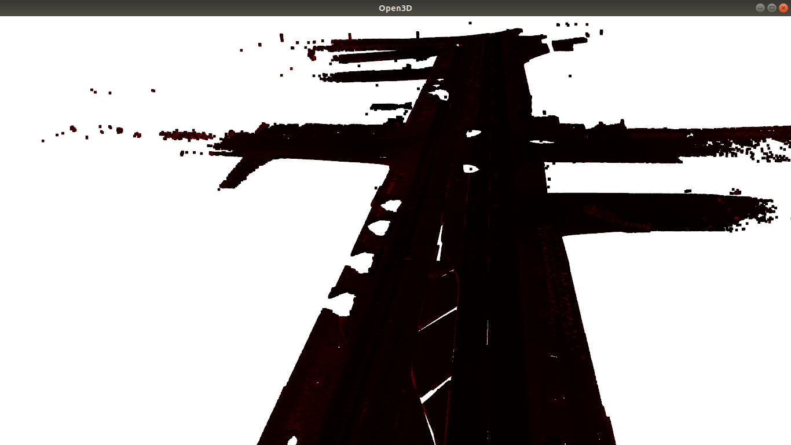
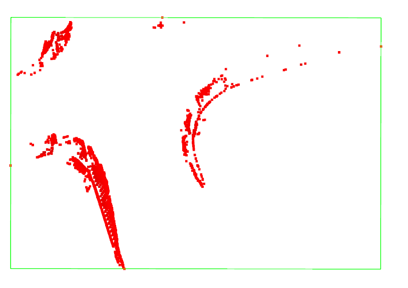

# Curb segmentation from point cloud
Scene L004.ply from [Toronto3D dataset](https://github.com/WeikaiTan/Toronto-3D) is used.

# Algorithm

1. Load .ply file and parse properties
2. Filter points with label 0 from ply files
3. Filter points by height and beam angle
4. Filter points by min z difference([A Practical Point Cloud Based Road Curb Detection 
Method for Autonomous Vehicle](https://www.researchgate.net/publication/318823588_A_Practical_Point_Cloud_Based_Road_Curb_Detection_Method_for_Autonomous_Vehicle))

# Results
|        Imported cloud        |  Curb segmentation on crossroad  |
|:----------------------------:|:--------------------------------:|
|   |    |

# Requirements
- Python 3.7
- Open3d
- Pyyaml
- Numpy

# Installation

    pip install -r requirements.txt